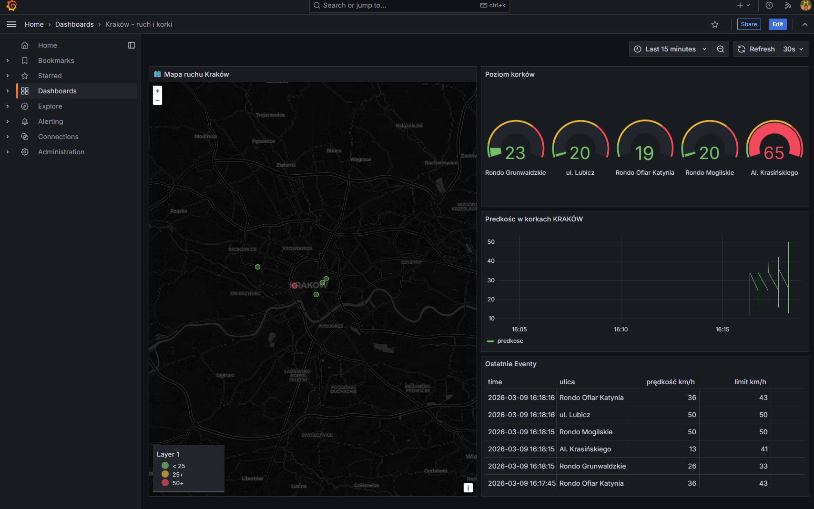

# 🏙️ Kraków Traffic Monitor

System monitorowania ruchu ulicznego w czasie rzeczywistym oparty na architekturze event-driven z wykorzystaniem Apache Kafka, PostgreSQL i Grafana.

Generatory login, click oraz purchase służa do testowania dasboardu.


---

## 📸 Dashboard

> Dashboard Grafana z danymi o ruchu ulicznym w Krakowie w czasie rzeczywistym.


---

## 🏗️ Architektura systemu

```
┌─────────────────────────────────────────────────────────┐
│                    GENERATORY EVENTÓW                    │
│  ┌──────────┐  ┌──────────┐  ┌──────────┐  ┌────────┐  │
│  │  click   │  │  login   │  │ purchase │  │traffic │  │
│  │ co 3 sek │  │ co 2 sek │  │ co 5 sek │  │co 30s  │  │
│  └────┬─────┘  └────┬─────┘  └────┬─────┘  └───┬────┘  │
└───────┼─────────────┼─────────────┼─────────────┼───────┘
        │             │             │             │
        ▼             ▼             ▼             ▼
┌─────────────────────────────────────────────────────────┐
│                     APACHE KAFKA                         │
│   click_events  login_events  purchase_events  traffic   │
└─────────────────────────┬───────────────────────────────┘
                          │
                          ▼
┌─────────────────────────────────────────────────────────┐
│                      CONSUMER                            │
│              Python + psycopg2                           │
└─────────────────────────┬───────────────────────────────┘
                          │
                          ▼
┌─────────────────────────────────────────────────────────┐
│                    POSTGRESQL                            │
│   click_events  login_events  purchase_events  traffic   │
└─────────────────────────┬───────────────────────────────┘
                          │
                          ▼
┌─────────────────────────────────────────────────────────┐
│                      GRAFANA                             │
│   🗺️ Mapa  🚦 Gauge  📈 Wykres  📋 Tabela              │
└─────────────────────────────────────────────────────────┘
```

---

## 🛠️ Technologie

| Technologia | Wersja | Zastosowanie |
|-------------|--------|--------------|
| Apache Kafka | 7.3.0 | Message broker, przesyłanie eventów |
| Zookeeper | 7.3.0 | Zarządzanie klastrem Kafka |
| PostgreSQL | 15 | Przechowywanie danych |
| Grafana | 11.4.0 | Wizualizacja danych, dashboard |
| Python | 3.12 | Generatory eventów, consumer |
| Docker | latest | Konteneryzacja całego systemu |
| TomTom API | v4 | Dane o ruchu ulicznym w czasie rzeczywistym |

---

## 📊 Źródła danych

### Symulowane eventy
- **click_events** — symulowane kliknięcia użytkowników (co 3 sekundy)
- **login_events** — symulowane logowania użytkowników (co 2 sekundy)
- **purchase_events** — symulowane zakupy z kwotą (co 5 sekund)

### Prawdziwe dane
- **traffic_events** — dane o ruchu ulicznym z **TomTom Traffic API** dla 5 punktów pomiarowych w Krakowie (co 30 sekund):
  - Rondo Grunwaldzkie
  - Al. Krasińskiego
  - Rondo Mogilskie
  - ul. Lubicz
  - Rondo Ofiar Katynia

---

## 📈 Dashboard Grafana

Dashboard zawiera 4 panele:

| Panel | Typ | Opis |
|-------|-----|------|
| 🚗 Prędkość ruchu w Krakowie | Time series | Wykres prędkości km/h dla każdej ulicy w czasie |
| 🚦 Poziom korków | Gauge | Wskaźnik korków w % z kolorami: 🟢 <25% 🟡 25-50% 🔴 >50% |
| 📋 Ostatnie eventy | Table | Tabela z ostatnimi pomiarami ruchu |
| 🗺️ Mapa ruchu Kraków | Geomap | Mapa Krakowa z kolorowymi punktami pomiarowymi |

---

## 🚀 Uruchomienie

### Wymagania
- Docker
- Docker Compose
- Klucz API TomTom (darmowy: https://developer.tomtom.com)

### Kroki

1. **Sklonuj repozytorium**
```bash
git clone https://github.com/stanszulc/docker-nauka.git
cd docker-nauka/streams
```

2. **Dodaj klucz TomTom API**
```bash
# Edytuj plik traffic/traffic_stream.py
# Zmień: API_KEY = "TUTAJ_WKLEJ_SWOJ_KLUCZ"
```

3. **Uruchom system**
```bash
docker-compose up -d
```

4. **Otwórz Grafanę**
```
http://localhost:3000
Login: admin
Hasło: admin
```

Dashboard załaduje się automatycznie! 🎉

---

## 🔒 Bezpieczeństwo

- Ochrona przed SQL Injection — weryfikacja nazw tabel przez whitelist
- Retry loop — generatory i consumer automatycznie wznawiają połączenie po awarii
- Persistent volumes — dane PostgreSQL i konfiguracja Grafany przeżywają restart

---

## 📁 Struktura projektu

```
streams/
├── click/              # Generator eventów click
├── login/              # Generator eventów login
├── purchase/           # Generator eventów purchase
├── traffic/            # Generator danych TomTom API
├── consumer/           # Consumer Kafka → PostgreSQL
├── grafana/
│   ├── dashboard.json  # Backup dashboardu
│   └── provisioning/   # Automatyczna konfiguracja Grafany
│       ├── datasources/
│       └── dashboards/
└── docker-compose.yml
```# docker-nauka